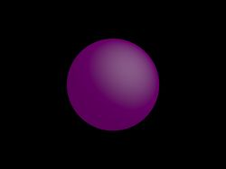

# Tutorial

## Importing the Lava Python bindings

There is currently no package for the Lava Python bindings, therefore to use it you need to add the installation folder to your Python path: 
```python
import sys
sys.path.append('/Lava/installation/folder')
```

Once this is done, simply import the `lava_python` module: 
```python
import lava_python as lava
print(lava.__doc__)
```

If you get an `ImportError: DLL load failed while importing lava_python`, you might need to provide the path to the OpenEXR, IMath and zlib DLLs to Python:
```python
import os
os.add_dll_directory('/path/to/OpenEXR/DLLs')
os.add_dll_directory('/path/to/Imath/DLLs')
os.add_dll_directory('/path/to/zlib/DLLs')
```

## Rendering a sphere

Here is a little sample code to create and render a sphere with `lava_python`:
```python
import lava_python as lava

scene = lava.Scene()

sphere = lava.make_sphere(center=lava.Vec3(0, 0, 0), radius=1)
purple = lava.Color(1, 0, 1)
sphere.material = purple
scene.add_surface(sphere)

sun_dir = lava.Vec3(1, 1, 1)
sun_dir.normalize()
sun = lava.make_sun_light(direction=sun_dir, brightness=1, color=lava.Color(1, 1, 1))
scene.add_light(sun)

cam = lava.make_camera(location=lava.Vec3(0, 0, 5), 
					   forward=lava.Vec3(0, 0, -1), up=lava.Vec3(0, 1, 0), 
					   sensor_width=36, field_of_view=90, 
					   z_near=0.1, z_far=100)
scene.set_camera(cam)

params = lava.RenderParams(16)
layers = lava.RenderLayers(1200, 900)

def my_callback(progress):
	print(f'progress: {progress}')

lava.render(scene, params, layers, my_callback)

lava.write_EXR(layers, '/path/to/image.exr')
```

If everything goes well, you should get something like this:

